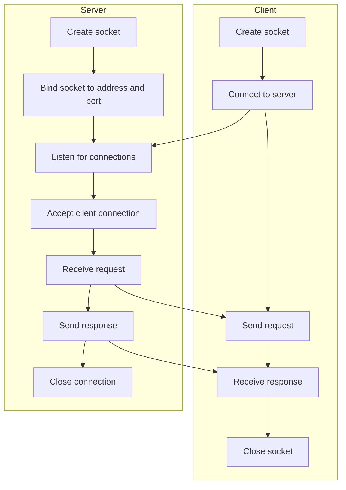
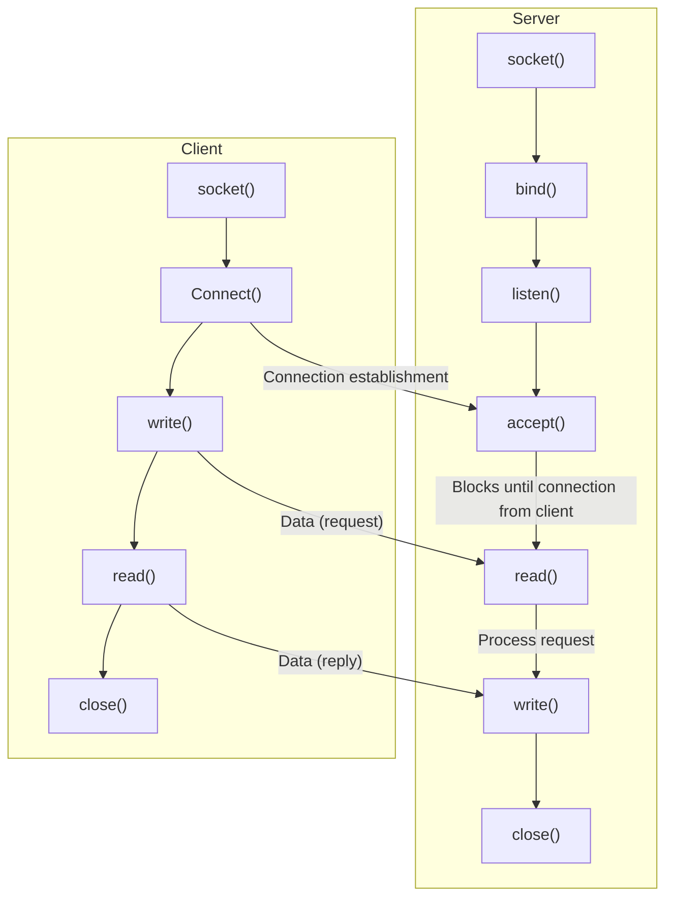
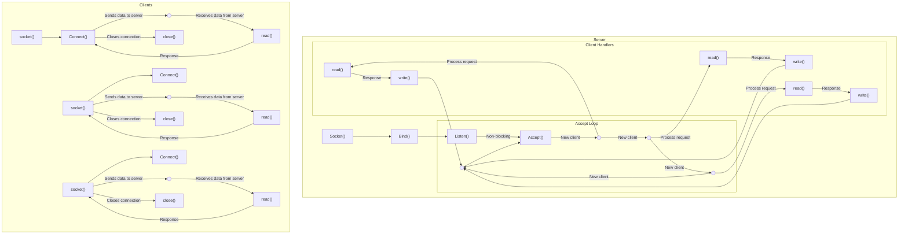

# Introduction
This projects aims to implements a `http web server` from scratch without using `boost` library. The server should be able to handle multiple connections and responde to HTTP/1.1 requests, including GET, POST, PUT, DELETE and others for serving static files and also dynamically generated content using CGI scripts. It parses the HTTP message, retrieves the requested resource if available, generates a HTTP response, and sends it back to client.

The project should includes a configuration file  that allows users to specify various settings such as port number, root directory, supported MIME types, and more.

In addition to handling HTTP request,the server also implement WebSocket to enable bidirectional communication between client and server over a single, long-lived TCP connection. WebSockets keep the connection open, enabling real-time communication between client and server. That is to say, client and server must remain close
connection until a handshake connection is establish and then they can exchange messages in either direction. 

The server should be designed to handle multiple simultaneous connections and uses a non-blocking I/O multiplexing technique with select() function. It is use to monitor multiple sockets for imcoming data or connection and then process the data or accept connections as they become available, without locking the entire application waiting got I/O. This allows the server to handle multiple connections efficiently without having to dedicate a seperated thread or process for each connection.

Through this project, learners will gain experience in network programming, socket programming, HTTP protocol and server administration.

# Open System Interconnection (OSI)
OSI is a conceptual framework that describe how data is transmitted over a network. It is divided into 7 layers, each with a specific function:

1. Physical Layer: This layer deals with the physical transmission of data, including the cables, connectors, and other hardware used to transmit data.

2. Data Link Layer: This layer is responsible for establishing a reliable connection between two devices on the network and managing data traffic between them.

3. Network Layer: This layer deals with routing and forwarding data between different networks and is responsible for addressing and delivery of data packets.

4. Transport Layer: This layer provides end-to-end communication between applications and ensures that data is transmitted reliably and accurately. HTTP server is here.

5. Session Layer: This layer establishes and maintains communication between applications on different devices.

6. Presentation Layer: This layer translates data into a format that can be understood by the receiving device.

7. Application Layer: This layer provides the interface between the user and the network and is responsible for managing communication between applications.


# Webserver
A web server is a software program that runs on a server (device or computer that is connected to a network and is capable of providing services or resources to other devices on the network) and is responsible for processing and responding to HTTP requests from web clients, such as web browsers. A web servers typically servers static content, such as HTML, CSS and images, as well as dynamic content, such as server-side scripts and applications.

Steps to build a web server in C++99, 
1. Set up a TCP/IP server socket: creating socket object binding to port number, and listning for incoming connections.
2. Accept incoming client connections: When a client connections to the server accept the connection and create a new socket to handle communication with the client.
3. Parse HTTP requests: Read the HTTP request from the client and parse it to determine the requested resource, such as a web page or image.
4. Generate HTTP response: Depending on the requested resource, generate an approapriate HTTP response, such as an HTML page, image file, or server-side script output.
5. Send HTTP response: Send the HTTP response back to the client over the socket connection.
6. Close the socket connection: When the response has been sent, close the socket connection with the client.

# What is HTTP Server?

[](image)
An HTTP server is a software program that runs on a computer and is responsible for handling incoming requests from clients over the HTTP (Hypertext Transfer Protocol) protocol. The server processes these requests and sends back the requested resources or data to the client in the form of an HTTP response. Typically, HTTP servers are used to host and serve websites, web applications, and other digital content over the internet. Examples of popular HTTP servers include Apache, Nginx, and Microsoft IIS. HTTP servers typically listen on a designated TCP port (usually port 80 or 443 for secure connections) and are accessed by clients using a web browser or other HTTP client software.<br>
[More info on http server](https://medium.com/@gabriellamedas/the-http-server-explained-c41380307917)

# I/O Multiplexing
. It's a system call that allows a program to monitor multiple file descriptors for events, such as incoming data or a connection being closed, without blocking. This enables the program to efficiently handle I/O operations on multiple sockets or files at the same time, improving performance and scalability. Other forms of I/O multiplexing include select() and epoll(), which serve similar purposes but with different performance characteristics and limitations. We are using poll() for our webserv project.

# How poll work - Our poll workflow


# How to manage multiple servers to read and write
Using loops. 

# explain The select() (or equivalent) should be in the main loop and should check file descriptors for read and write AT THE SAME TIME. 
Refer to our poll workflow picture for the main loop. 


# only one read or one write per client per select() (or equivalent). show you the code from the select() (or equivalent) to the read and write of a client.

# Search for all read/recv/write/send on a socket and check that, if an error is returned, the client is removed.


# The project must compile without any re-link issue. If not, use the 'Invalid compilation' flag.
it will output "make: Nothing to be done for `all'." on 2nd attempt after first success atempt "make"

# Setup routes in a server to different directories.
root outside location is known as global root in our own configuration format. Set root path to main directory for a server

# If errno is checked after read/recv/write/send, the grade is 0 and the evaluation process ends now
```c++
if (bytesSent == -1)
		N_MY::msg("Error sending response to client");
	else if (bytesSent == 0)
		N_MY::msg("Server closed the connection with the client");
	else
		N_MY::msg("Server sent a response to the client\n\n");
```
# Writing or reading ANY file descriptor without going through the select() (or equivalent) is strictly FORBIDDEN.
Our recv and send is after poll(). Refer to our poll workflow

# Setup a default file to search for if you ask for a directory.
It will show index file by default. In our configuration, keyword "index" is our default file. 

# Socket
In networking, a socket is a software endpoint that enables communication between two networked devices. It is an abstration layer that provides a consistent interface for communication over different type of networks, such as internet or a local area network(LAN).

A socket is identified by an IP address and a port number. The IP address identifies the device on the network, while the port number identifies the specific service or application thaat is using the socket. For example, a web server may user port 80 for HTTP requests and port 443 for HTTPS requests.

# Port
A port is a communication endpoint in a networked system that enales different services or applications to run on the same device and share network resources. It is a 16-bit number that identifies a specific process running on a device. Port numbers range from  0 to 65535.

```
Well known ports(0 - 1023) reserved for system services and applications.
Registered ports(1024 - 49151)
Dynamic or private ports(49152 - 65535)
```

When two devices communicate over a network, they establish a connection by specifying the destination IP address and port number. The sender creates a socket to send data to the receiver's IP address and port, and the receiver creates a socket to receive the data. This enables the devices to exchange data and communicate with each other over the network.

# Common Gateway Interface (CGI)
CGI is a protocol to facilitate communication betweenn a webserver with other programs such as databases, scripting languages, and other applications. This allows web pages to be generated dynamically based on user input or other parameters.


# Workflow ([Credit:Neosizzle](https://github.com/neosizzle/webserv))
```mermaid
sequenceDiagram
Client->>+select(): tcp handshake connection
loop x seconds
select()->>Webserver: waiting to accept connection...
end
Webserver-->>select(): accept connection
select()-->>-Client: confirm handshake

loop x seconds
Client->>select(): waiting for data...
end

Client->>+select(): http request
select()->>Webserver: request accepted
Webserver->>CGI: unchunk and parses request
CGI-->>Webserver: returns primitive data
Webserver-->>select(): parses response
deactivate select()
loop x seconds
Client-->select(): waiting for write available
end

activate select()
select()-->Client: http response
deactivate select()
```

# A TCP server-client interaction

# A TCP server-client interaction with function



# Multiclient server handling non-blocking model


## References
1. [Build webserver from scratch c++](https://www.youtube.com/watch?v=bEsRapsPAWI)
2. [Medium Blog](https://medium.com/from-the-scratch/http-server-what-do-you-need-to-know-to-build-a-simple-http-server-from-scratch-d1ef8945e4fa)
3. [Socket programming](https://www.geeksforgeeks.org/socket-programming-in-cc-handling-multiple-clients-on-server-without-multi-threading/)
4. [Nginx](https://www.server-world.info/en/note?os=Ubuntu_20.04&p=nginx&f=1)
5. [OSI model](https://www.cloudflare.com/en-gb/learning/ddos/glossary/open-systems-interconnection-model-osi/)
6. [Beej](https://beej.us/guide/bgnet/)
7. [Webserv](https://github.com/Jibus22/webserv/wiki)
8. [TLS/SSL](https://www.youtube.com/watch?v=LJDsdSh1CYM)
9. [Trugam reference](https://github.com/trungams/http-server)
10. [Trugam blog](https://github.com/trungams/http-server)
11. [Request and response message](https://en.wikipedia.org/wiki/HTTP#HTTP/1.1_request_messages)
12. [Rhymu TCP/IP](https://www.youtube.com/watch?v=C7CpfL1p6y0&list=PLbtjxiXev6lqCUaPWVMXaKxrJtHRRxcpM)
13. [Neso academy socket](https://www.youtube.com/watch?v=uagKTbohimU)
14. [free code camp socket](https://www.youtube.com/watch?v=8ARodQ4Wlf4)
15. [multiple client on server handle](https://www.geeksforgeeks.org/socket-programming-in-cc-handling-multiple-clients-on-server-without-multi-threading/)
16. [Socket Programming basic presentation The security tube](https://www.youtube.com/watch?v=eVYsIolL2gE)
17. [Jibus22 webser](https://github.com/Jibus22/webserv/wiki/CGI#-documentation)
18. [Socket Programming functions Chirag Bhalodia](https://www.youtube.com/watch?v=k_P2E7ZvhYs)
19. [NGINX directives](https://www.javatpoint.com/nginx-directive-and-context)
20. [NGINX freecodecamp](https://www.freecodecamp.org/news/the-nginx-handbook/#how-to-install-nginx)
